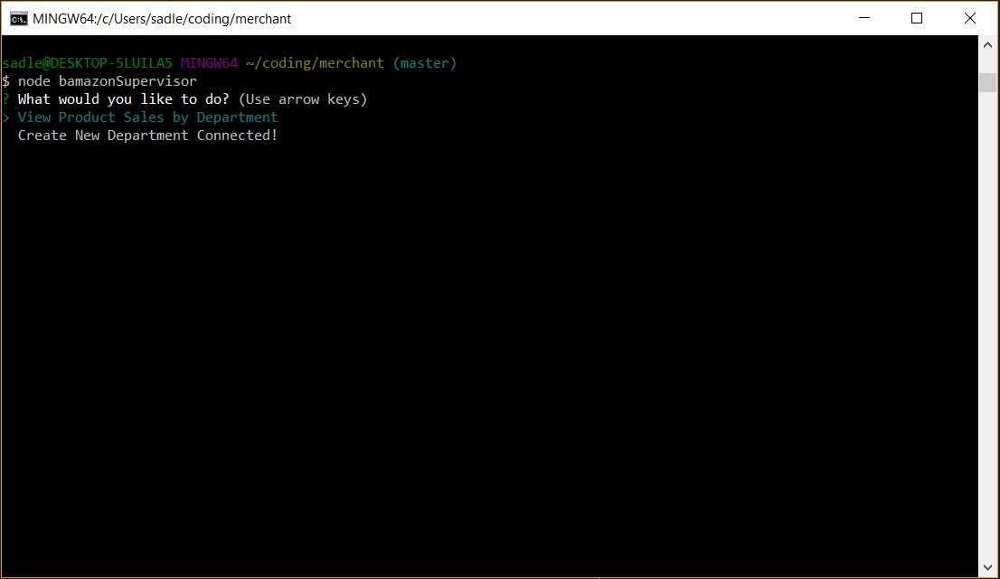

# merchant

## Description

A simple commerce app that was developed to practice and demonstrate my skills with an emphasis on node.js and SQL.

I hope to eventually integrate this project with my MMORPG project, hence the RPG product references!

## Walkthrough

There are 3 components to this app:

### Customer View

A customer can launch the app with the command:

    node bamazonCustomer

This will immediately display a list of all product IDs, names, and prices. The customer will then be prompted for the product ID and quantity that they want to purchase. If there is sufficient stock available, the total purchase price will be displayed and the database will be updated.

### Manager View

A manager can launch the app with the command:

    node bamazonManager

This will immediately display a menu of actions that the manager can perform.

#### Manager - View All Products

Selecting the 'View Products for Sale' option will display a table of all product IDs, names, prices, and stock.

#### Manager - View Low Stock Products

Selecting the 'View Low Inventory' option will display a table of all product IDs, names, prices, and stock with less than 5 items in stock.

#### Manager - Add Product Inventory

Selecting the 'Add to Inventory' option will prompt the manager to enter a product and the quantity that they want to stock. The database will then be updated.

#### Manager - Add New Product

Selecting the 'Add New Product' option will prompt the manager to enter the new product's name, department, price, and stock. The database will then be updated.

### Supervisor View

A supervisor can launch the app with the command:

    node bamazonSupervisor

This will immediately display a menu of actions that the supervisor can perform.

#### Supervisor - View Department Sales

Selecting the 'View Product Sales by Department' option will display a table of department IDs, names, overhead, sales, and profit.

#### Supervisor - Add New Department

Selecting the 'Create New Department' will prompt the supervisor to enter the new department's name and overhead cost. The database will then be updated.

## Contribution and Help

Morrowii is the sole person maintaining and contributing to this project.

If you need help with anything related to this project, drop me a line on GitHub.
